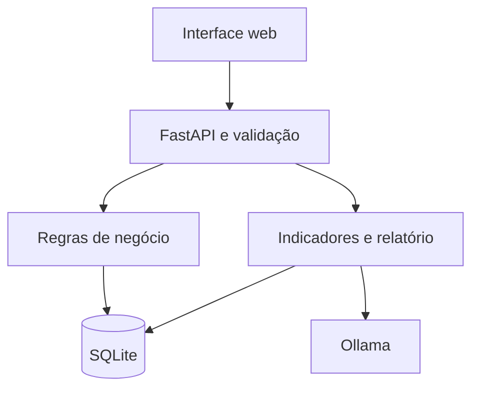

# Prato Cheio - Checkpoint 2

Aplicação para organizar doações de alimentos entre estabelecimentos e instituições.
Evolução do backend do CP1, com interface web, dashboard e relatório contextual por LLM.

## Integrantes

| Nome | RM |
|---|---|
| Leonardo Viana | 571969 |
| João Paulo Melo | 570118 |
| Pedro Grigorio | 570308 |
| Cauã da Silva Lima | 571023 |

## Problema e solução

A comunicação informal sobre sobras de alimentos dificulta consultar disponibilidade,
evitar reservas duplicadas e verificar as condições de armazenamento da instituição.
O doador publica o lote, a instituição reserva uma quantidade e registra a coleta.
O cancelamento de uma reserva pendente devolve o saldo. Coletas já realizadas permanecem no histórico.

Escopo: cadastro de doadores/instituições, lotes, reservas, coleta, indicadores e relatório de prioridade.
O protótipo não realiza entregas, pagamentos nem avaliação sanitária do alimento.

## Execução local (Python 3.11 ou superior)

Extraia o ZIP e abra um terminal na pasta que contém `main.py`.

```bash
python -m venv .venv
# Windows:
.venv\Scripts\activate
# Linux/macOS:
source .venv/bin/activate
pip install -r requirements.txt
python iniciar.py
```

Abra http://127.0.0.1:8000/app e use a chave de acesso impressa no terminal.
O inicializador cria `.env` com uma chave aleatória se ele não existir e insere dados de demonstração
apenas em um banco vazio. Nunca apaga dados existentes. O ZIP inclui um banco SQLite de demonstração.
Os registros são fictícios e as datas do banco incluído usam 05/10/2026 como referência.
Se quiser uma demonstração com datas novas, guarde o banco atual e execute `seed.py` com
`DATABASE_URL` apontando para um novo arquivo vazio. Não exclua um banco com dados de uso real.

## LLM local

Instale o Ollama de https://ollama.com/download. Em outro terminal:

```bash
ollama pull qwen2.5:0.5b
ollama serve
```

Se o Ollama já estiver em execução, basta baixar o modelo. Na aplicação, abra
**Relatórios com IA** e clique em **Gerar relatório**. A aplicação salva a resposta no banco.
O modelo pequeno reduz o requisito de memória, mas pode cometer erros de português ou de interpretação.
Um modelo maior pode ser configurado em `OLLAMA_MODEL`, após o respectivo download.
Não há chave de serviço pago na configuração padrão. O download requer internet e o computador executa a inferência.

### Alternativa com Docker

```bash
docker compose up --build
```

A primeira execução baixa automaticamente o modelo. Aguarde a conclusão de `ollama-init`.
Acesse http://127.0.0.1:8000/app e copie a chave administrativa dos logs de `api`.
O volume `dados` mantém o banco entre reinícios. O volume `modelos` mantém a LLM.

## Configuração

| Variável | Padrão ou finalidade |
|---|---|
| DATABASE_URL | sqlite:///./prato_cheio.db |
| API_TOKEN | Chave administrativa obrigatória. `iniciar.py` cria uma chave local aleatória |
| OLLAMA_URL | http://localhost:11434 |
| OLLAMA_MODEL | qwen2.5:0.5b |

Nunca publique `.env` no GitHub. A chave fica apenas na memória da página e sai ao recarregar.
A autenticação é administrativa e compartilhada, suficiente para uma demonstração local.
Permissões por instituição e login individual permanecem fora desta versão.
O servidor local usa 127.0.0.1. Uma publicação externa requer HTTPS e gestão própria de usuários.

## Arquitetura

Frontend em HTML/CSS/JavaScript servido pelo mesmo FastAPI, sem dependência de CDN.
`fetch` consome os endpoints com Bearer token. Os routers recebem os dados, schemas validam
as entradas, `crud.py` executa regras e SQLAlchemy persiste os registros.
`services/dashboard.py` consolida indicadores com SQL e `services/llm.py` chama o Ollama.



## Interface e dashboard

Navegação: visão geral, doações, reservas, doadores, instituições e relatórios com IA.
As telas permitem cadastro e edição. As reservas permitem coleta e cancelamento.
As listagens têm paginação de dez itens. As doações aceitam filtros de categoria e disponibilidade.
Erros da API aparecem na interface, e operações concluídas recebem confirmação.
O dashboard consulta o banco e apresenta lotes disponíveis, reservas pendentes, coletas,
gráfico de categorias e lotes com validade em até dois dias. O saldo aparece separado por unidade.
Os IDs de doadores e instituições podem ser consultados nas respectivas telas antes do cadastro de lote/reserva.

## Banco revisado

Tabelas: doadores, instituicoes, doacoes, reservas e relatorios_ia.
As entidades de cadastro são independentes. Doações referenciam o doador, reservas referenciam
a doação e a instituição. A reserva contém quantidade e situação próprias.
Nomes, CNPJ e contatos não são repetidos em reservas.
Chaves estrangeiras ficam ativas no SQLite e exclusões com histórico são bloqueadas.
Restrições CHECK impedem quantidades negativas e saldo comprometido superior ao total.
Índices cobrem status/validade/categoria das doações e vínculos de reservas.
`quantidade_reservada` é um saldo comprometido que inclui reservas pendentes e coletadas:
é uma redundância controlada para a operação de estoque. A transação atualiza reserva e saldo juntas.
O documento `docs/BANCO.md` explica a decisão, índices e migração do CP1.

## Endpoints e Swagger

Swagger: http://127.0.0.1:8000/docs
ReDoc: http://127.0.0.1:8000/redoc
OpenAPI: http://127.0.0.1:8000/openapi.json ou `docs/openapi.json`.
No Swagger, clique em **Authorize** e informe a chave mostrada por `iniciar.py`.

| Rotas | Operações |
|---|---|
| /doadores e /instituicoes | GET/POST, GET/PUT/DELETE por ID |
| /doacoes | GET/POST, GET/PUT/DELETE por ID, PATCH /{id}/cancelar |
| /reservas | GET/POST, GET/DELETE por ID, PATCH /{id}/coletar |
| /dashboard | GET de indicadores reais do banco |
| /ia/status | GET de disponibilidade do modelo |
| /ia/relatorio | POST que chama a LLM e salva o texto |
| /ia/relatorios | GET dos últimos 20 relatórios |

Listagens: `pagina` >= 1 e `limite` entre 1 e 100.
Doações: `categoria`, `status` e `apenas_disponiveis`.
Reservas: `status`, `doacao_id`, `instituicao_id`.
Doadores: `cidade`, `ativo`. Instituições: `cidade`, `possui_refrigeracao`.

Respostas de erro: `erro`, `status`, e `campos` em falhas de validação.
Códigos: 200/201/204 para sucesso, 400 para edição vazia, 401 para acesso inválido,
404 para registro inexistente, 409 para conflito e 422 para dados/regras inválidos.
A LLM indisponível retorna 503. Nenhum relatório simulado é salvo como geração real.

## Otimizações

- Paginação limitada e ordenação por ID para listas estáveis.
- Filtros e agregações executados no banco.
- Índices por campos de consulta e relacionamento.
- Uma requisição de dashboard reúne os indicadores da tela.
- Reserva usa atualização condicional e transação para impedir uso concorrente do saldo.
- SQLite serializa mutações de reserva/coleta/cancelamento com `BEGIN IMMEDIATE`.

Não há benchmark de ganho percentual. A escolha SQLite atende à apresentação local.
Migração para outro banco requer revisão explícita do controle de concorrência.
Quantidades usam Float, herdado do CP1, sem garantia de precisão decimal para operações financeiras.

## LLM aplicada ao projeto

Modelo/serviço: Qwen2.5 0.5B via Ollama local, POST `/api/generate`, sem streaming.
Finalidade: resumir estoque e sugerir prioridades de retirada dos lotes próximos do vencimento.
Entrada: contagens, totais separados por unidade, categorias, IDs, validade e saldo de lotes urgentes.
Não envia descrição livre, nome, CNPJ, contato nem local de retirada.
Saída: texto em português apresentado na interface e persistido em `relatorios_ia`.
O prompt manda usar apenas os dados, separar unidades e não autorizar operações.
A IA não modifica o estoque. A pessoa confere as recomendações antes de agir.
Limitações: alucinação, análise incompleta, tempo de geração e dependência do serviço/modelo instalado.
Consulte `docs/LLM.md` para o contrato e a distinção entre teste simulado e execução real.

## Testes

```bash
python -m pytest -q
```

Os testes criam um SQLite temporário. Não alteram o banco da apresentação.
Cobrem fluxo de reserva/coleta, cancelamento, refrigeração, duplicidade, validade,
integridade, validações, paginação, autenticação, dashboard, concorrência e contrato da LLM.
Resultados e limites de validação: `docs/VALIDACAO.md`.

## Apresentação e organização

`APRESENTACAO_CP2.pptx`: slides editáveis.
`docs/ROTEIRO.md`: demonstração e distribuição sugerida entre os integrantes.
`docs/REQUISICOES.http`: requisições principais para VS Code REST Client.
`TRELLO.md` e `docs/QUADRO_CP2.csv`: registro de organização e tarefas do quadro Trello.

### Links do projeto

Repositório: https://github.com/Cauasl17/prato-cheio-cp2

Quadro Trello: https://trello.com/b/x4UExcxZ/trello-cp
O planejamento está em `TRELLO.md` e `docs/QUADRO_CP2.csv`.
